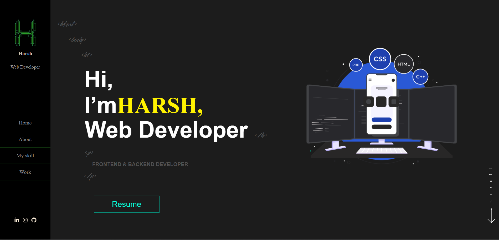

# My Portfolio
Welcome to my personal portfolio website! This repository contains the source code and assets for my online portfolio.

## Table of Contents

* [Features](#features)
* [Technologies](#technologies)
* [Installation](#installation)
* [Usage](#usage)

### Overview
This portfolio website serves as a showcase of my work, skills, and experiences. It provides visitors with information about who I am, my projects, and how to get in touch.

### Features
About Me Section: A brief introduction about myself, highlighting my background, skills, and interests.

Project Showcase: Displaying a selection of my projects with descriptions and links.

Resume Download: Providing a downloadable version of my resume for visitors.

Contact Form: Enabling visitors to get in touch with me through a social links.

Responsive Design: Ensuring a seamless experience on various devices.

Technologies Used

React js: A JavaScript library for building user interfaces.

CSS3: Styling and layout.

Jsx: Adding interactivity and dynamic behavior.

FontAwesome: Icons for enhanced visual appeal.

Git/GitHub: Version control and repository hosting.

### Installation
Clone Repository:

bash

Copy code

git clone https://github.com/harshKumar029/myportfolio.git

cd portfolio

npm start

Visit http://localhost:3000 in your browser to view the portfolio.

### Usage

Explore the different sections of the portfolio, including the about me, projects. Feel free to download my resume and get in touch using the provided contact form.